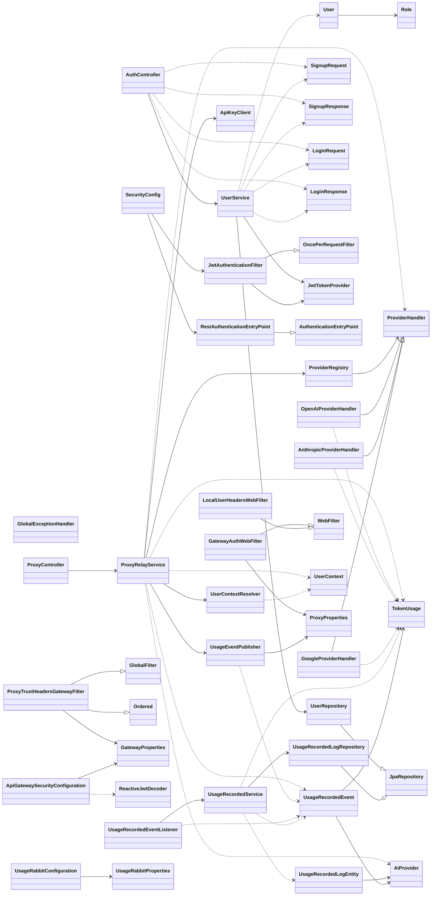

# Class Diagram

```mermaid
classDiagram
direction LR

class AuthController
class GlobalExceptionHandler
class UserService
class UserRepository
class JpaRepository
class User
class Role
class SignupRequest
class SignupResponse
class LoginRequest
class LoginResponse
class SecurityConfig
class JwtAuthenticationFilter
class OncePerRequestFilter
class JwtTokenProvider
class RestAuthenticationEntryPoint
class AuthenticationEntryPoint

class ProxyController
class ProxyRelayService
class ProviderHandler
class ProviderRegistry
class OpenAiProviderHandler
class AnthropicProviderHandler
class GoogleProviderHandler
class ApiKeyClient
class UsageEventPublisher
class GatewayAuthWebFilter
class LocalUserHeadersWebFilter
class WebFilter
class UserContextResolver
class UserContext
class ProxyProperties

class ProxyTrustHeadersGatewayFilter
class GlobalFilter
class Ordered
class ApiGatewaySecurityConfiguration
class GatewayProperties
class ReactiveJwtDecoder

class UsageRecordedEventListener
class UsageRecordedService
class UsageRecordedLogRepository
class UsageRecordedLogEntity
class UsageRabbitConfiguration
class UsageRabbitProperties

class UsageRecordedEvent
class TokenUsage
class AiProvider

AuthController --> UserService
AuthController ..> SignupRequest
AuthController ..> SignupResponse
AuthController ..> LoginRequest
AuthController ..> LoginResponse

UserService --> UserRepository
UserService --> JwtTokenProvider
UserService ..> User
UserService ..> SignupRequest
UserService ..> SignupResponse
UserService ..> LoginRequest
UserService ..> LoginResponse

UserRepository --|> JpaRepository
User --> Role

JwtAuthenticationFilter --|> OncePerRequestFilter
JwtAuthenticationFilter --> JwtTokenProvider
RestAuthenticationEntryPoint --|> AuthenticationEntryPoint
SecurityConfig --> JwtAuthenticationFilter
SecurityConfig --> RestAuthenticationEntryPoint

ProxyController --> ProxyRelayService
ProxyRelayService --> ProviderRegistry
ProxyRelayService --> ApiKeyClient
ProxyRelayService --> UsageEventPublisher
ProxyRelayService --> UserContextResolver
ProxyRelayService ..> ProviderHandler
ProxyRelayService ..> UserContext
ProxyRelayService ..> UsageRecordedEvent
ProxyRelayService ..> TokenUsage
ProxyRelayService ..> AiProvider

ProviderRegistry --> ProviderHandler
OpenAiProviderHandler --|> ProviderHandler
AnthropicProviderHandler --|> ProviderHandler
GoogleProviderHandler --|> ProviderHandler
OpenAiProviderHandler ..> TokenUsage
AnthropicProviderHandler ..> TokenUsage
GoogleProviderHandler ..> TokenUsage

GatewayAuthWebFilter --|> WebFilter
LocalUserHeadersWebFilter --|> WebFilter
GatewayAuthWebFilter --> ProxyProperties
UserContextResolver ..> UserContext

UsageEventPublisher --> ProxyProperties
UsageEventPublisher ..> UsageRecordedEvent

ProxyTrustHeadersGatewayFilter --|> GlobalFilter
ProxyTrustHeadersGatewayFilter --|> Ordered
ProxyTrustHeadersGatewayFilter --> GatewayProperties
ApiGatewaySecurityConfiguration --> GatewayProperties
ApiGatewaySecurityConfiguration ..> ReactiveJwtDecoder

UsageRecordedEventListener --> UsageRecordedService
UsageRecordedEventListener ..> UsageRecordedEvent
UsageRecordedService --> UsageRecordedLogRepository
UsageRecordedService ..> UsageRecordedLogEntity
UsageRecordedService ..> UsageRecordedEvent
UsageRecordedService ..> TokenUsage
UsageRecordedLogRepository --|> JpaRepository
UsageRecordedLogEntity --> AiProvider

UsageRabbitConfiguration --> UsageRabbitProperties

UsageRecordedEvent --> TokenUsage
UsageRecordedEvent --> AiProvider
```
